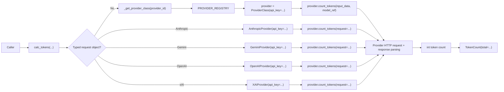

# API Module

`src/kentokit/api.py` is the public entry point for token counting. It keeps the package surface small by exposing one function, `calc_tokens`, plus the normalized `TokenCount` return model, and delegates provider-specific behavior to the provider registry.

## Responsibilities

- Accept the public inputs required to count tokens: plain-text `input_data` plus `model_ref`, or a provider-native typed request object for Anthropic, Gemini, OpenAI, or xAI when `provider_id` matches, together with `provider_id` and `api_key`.
- Resolve the provider implementation from the registry in `kentokit.providers`.
- Instantiate the provider, collect the integer token count, and return a `TokenCount`.
- Reject unsupported providers before any network request is made.

## Public surface

The module exposes one public function and works with four public request models:

- `calc_tokens(...) -> TokenCount`: dispatch plain-text requests to any provider and dispatch `AnthropicCountTokensRequest`, `GeminiCountTokensRequest`, `OpenAICountTokensRequest`, or `XAICountTokensRequest` only to their matching providers.
- `TokenCount(total: int)`: normalized response model for the public API. It also exposes `TokenCount.from_anthropic(...)`, `TokenCount.from_gemini(...)`, `TokenCount.from_openai(...)`, and `TokenCount.from_xai(...)` for typed provider paths.
- `AnthropicCountTokensRequest(model: str, messages: list[dict[str, Any]], ...)`: validated Anthropic request model used by the Anthropic-specific typed paths.
- `GeminiCountTokensRequest(model: str, contents: list[dict[str, Any]] | None, generate_content_request: dict[str, Any] | None)`: validated Gemini request model used by the Gemini-specific typed paths.
- `OpenAICountTokensRequest(model: str, input: str)`: validated OpenAI request model used by the OpenAI-specific typed paths.
- `XAICountTokensRequest(model: str, text: str)`: validated xAI request model used by the xAI-specific typed paths.

The module also contains one internal helper:

- `_get_provider_class(...) -> type[ProviderBase]`: lookup wrapper around `PROVIDER_REGISTRY` that raises `UnsupportedProviderError` for unknown provider identifiers.

## Request flow

## Module dependencies

- `kentokit.requests.anthropic.AnthropicCountTokensRequest`: validated Anthropic request abstraction for the typed Anthropic path.
- `kentokit.requests.gemini.GeminiCountTokensRequest`: validated Gemini request abstraction for the typed Gemini path.
- `kentokit.requests.openai.OpenAICountTokensRequest`: validated OpenAI request abstraction for the typed OpenAI path.
- `kentokit.requests.xai.XAICountTokensRequest`: validated xAI request abstraction for the typed xAI path.
- `kentokit.providers.PROVIDER_REGISTRY`: source of truth for supported providers.
- `kentokit.providers.base.ProviderBase`: base type returned by the registry.
- `kentokit.providers.base.ProviderId`: supported provider identifier literal type.
- `kentokit.providers.base.UnsupportedProviderError`: raised when the provider id is not registered.
- `kentokit.providers.anthropic.AnthropicProvider`: Anthropic transport used by the request-object path and `TokenCount.from_anthropic(...)`.
- `kentokit.providers.gemini.GeminiProvider`: Gemini transport used by the request-object path and `TokenCount.from_gemini(...)`.
- `kentokit.providers.openai.OpenAIProvider`: OpenAI transport used by the request-object path and `TokenCount.from_openai(...)`.
- `kentokit.providers.xai.XAIProvider`: xAI transport used by the request-object path and `TokenCount.from_xai(...)`.

## Error model

`calc_tokens` can fail in two distinct ways:

- `UnsupportedProviderError`: the caller passed a provider id that is not registered.
- `TokenCountError`: the resolved provider failed to make the request, decode the response, or extract the expected token count.
- `TypeError`: the caller passed an `AnthropicCountTokensRequest`, `GeminiCountTokensRequest`, `OpenAICountTokensRequest`, or `XAICountTokensRequest` with a mismatched provider id, or mixed a request object with `model_ref`.

The API module does not catch and translate provider failures. It lets provider-layer errors propagate so callers can inspect the provider id, HTTP status code, and response text carried by `TokenCountError`.

## Design notes

- The API layer does not know provider-specific URLs, headers, or payload shapes.
- Provider instances are created per call with only the API key as constructor state.
- `calc_tokens` remains provider-agnostic for plain-text requests, with narrow overloads for typed request models where needed.
- Adding a new provider should not require changing `calc_tokens`; only the registry and provider implementation need to change, unless that provider also gets a typed request model like the current Anthropic, Gemini, OpenAI, and xAI paths.
