# API Module

`src/kentokit/api.py` is the public entry point for token counting. It keeps the package surface small by exposing one function, `calc_tokens`, plus the normalized `TokenCount` return model, and delegates provider-specific behavior to the provider registry.

## Responsibilities

- Accept the public inputs required to count tokens: `input_data`, `model_ref`, `provider_id`, and `api_key`.
- Resolve the provider implementation from the registry in `kentokit.providers`.
- Instantiate the provider, collect the integer token count, and return a `TokenCount`.
- Reject unsupported providers before any network request is made.

## Public surface

The module exposes one public function and returns one public model:

- `calc_tokens(...) -> TokenCount`: validate the provider identifier indirectly through the registry, construct the provider instance, and wrap the provider-reported count in `TokenCount(total=...)`.
- `TokenCount(total: int)`: normalized response model for the public API.

The module also contains one internal helper:

- `_get_provider_class(...) -> type[ProviderBase]`: lookup wrapper around `PROVIDER_REGISTRY` that raises `UnsupportedProviderError` for unknown provider identifiers.

## Request flow

```mermaid
flowchart LR
    A["Caller"] --> B["calc_tokens(...)"]
    B --> C["_get_provider_class(provider_id)"]
    C --> D["PROVIDER_REGISTRY"]
    D --> E["Provider class"]
    E --> F["provider = ProviderClass(api_key=...)"]
    F --> G["provider.count_tokens(input_data, model_ref)"]
    G --> H["Provider HTTP request + response parsing"]
    H --> I["int token count"]
    I --> J["TokenCount(total=...)"]
```

## Module dependencies

- `kentokit.providers.PROVIDER_REGISTRY`: source of truth for supported providers.
- `kentokit.providers.base.ProviderBase`: base type returned by the registry.
- `kentokit.providers.base.ProviderId`: supported provider identifier literal type.
- `kentokit.providers.base.UnsupportedProviderError`: raised when the provider id is not registered.

## Error model

`calc_tokens` can fail in two distinct ways:

- `UnsupportedProviderError`: the caller passed a provider id that is not registered.
- `TokenCountError`: the resolved provider failed to make the request, decode the response, or extract the expected token count.

The API module does not catch and translate provider failures. It lets provider-layer errors propagate so callers can inspect the provider id, HTTP status code, and response text carried by `TokenCountError`.

## Design notes

- The API layer does not know provider-specific URLs, headers, or payload shapes.
- Provider instances are created per call with only the API key as constructor state.
- Adding a new provider should not require changing `calc_tokens`; only the registry and provider implementation need to change.
