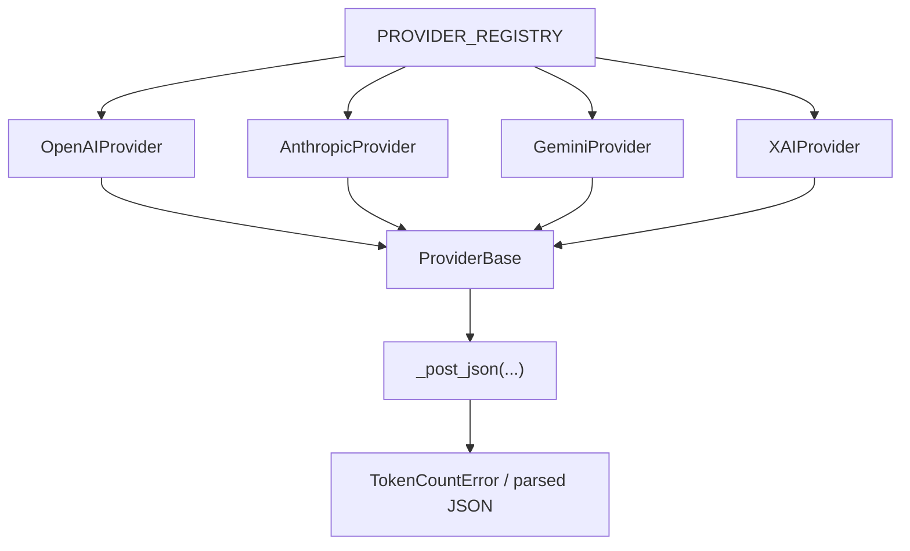

# Providers Package

`src/kentokit/providers/` contains the provider abstraction, provider registry, and one implementation per supported upstream API. The package isolates all HTTP and response-shape differences behind a shared interface.

## Package structure

- `base.py`: shared provider contract and common HTTP/error handling.
- `__init__.py`: registry mapping provider ids to concrete provider classes.
- `openai.py`: OpenAI implementation.
- `anthropic.py`: Anthropic implementation.
- `gemini.py`: Gemini implementation.
- `xai.py`: xAI implementation.

## Architecture

## Registry

`src/kentokit/providers/__init__.py` defines `PROVIDER_REGISTRY`, a `dict[ProviderId, type[ProviderBase]]`.

This registry is the package-level dispatch table:

- It defines which `provider_id` values the public API accepts.
- It maps each supported provider id to one concrete implementation class.
- It keeps the dispatch logic centralized so the public API does not need conditionals for each provider.

## Base provider contract

`ProviderBase` in `base.py` defines the common execution flow for all providers:

1. Build the request URL with `build_url(...)`.
2. Build headers with `build_headers(...)`.
3. Build the JSON payload with `build_payload(...)`.
4. Send the request through `_post_json(...)`.
5. Parse the integer count with `parse_token_count(...)`.

Subclasses must implement:

- `build_url(...)`
- `build_payload(...)`
- `parse_token_count(...)`

Subclasses may override:

- `build_headers(...)`

`ProviderBase` also owns the shared failure model through `TokenCountError` and `UnsupportedProviderError`.

## Common behavior in `base.py`

The shared implementation is intentionally small:

- `count_tokens(...)` supports an optional `httpx.Client` so tests can inject a client instead of creating a real one.
- `_post_json(...)` performs the POST request, raises `TokenCountError` for HTTP/network/JSON failures, and requires the decoded body to be a JSON object.
- `timeout_seconds` is defined once on the base class and used for managed clients.

## Provider-specific differences

| Provider | URL strategy | Auth strategy | Payload shape | Count extraction |
| --- | --- | --- | --- | --- |
| OpenAI | Fixed `/v1/responses/input_tokens` endpoint | `Authorization: Bearer ...` header | `{"input": ..., "model": ...}` | `input_tokens` integer |
| Anthropic | Fixed `/v1/messages/count_tokens` endpoint | `x-api-key` plus `anthropic-version` header | `messages` array with one user message | `input_tokens` integer |
| Gemini | Model-specific URL with `:countTokens` suffix | API key in query string | `contents` array with one user part | `totalTokens` integer |
| xAI | Fixed `/v1/tokenize-text` endpoint | `Authorization: Bearer ...` header | `{"model": ..., "text": ...}` | length of `token_ids`, `tokenIds`, or `tokens` |

## Gemini-specific normalization

`GeminiProvider` includes `normalize_model_ref(...)` because Gemini expects model references prefixed with `models/`. The provider normalizes that input before building the URL, so callers can pass either form.

## Adding a new provider

To add another provider, the current design expects three changes:

1. Create a new `ProviderBase` subclass in `src/kentokit/providers/`.
2. Implement URL, payload, and token-count parsing for that provider.
3. Register the class in `PROVIDER_REGISTRY` and extend `ProviderId`.

No changes should be required in `src/kentokit/api.py` as long as the registry remains the dispatch boundary.
